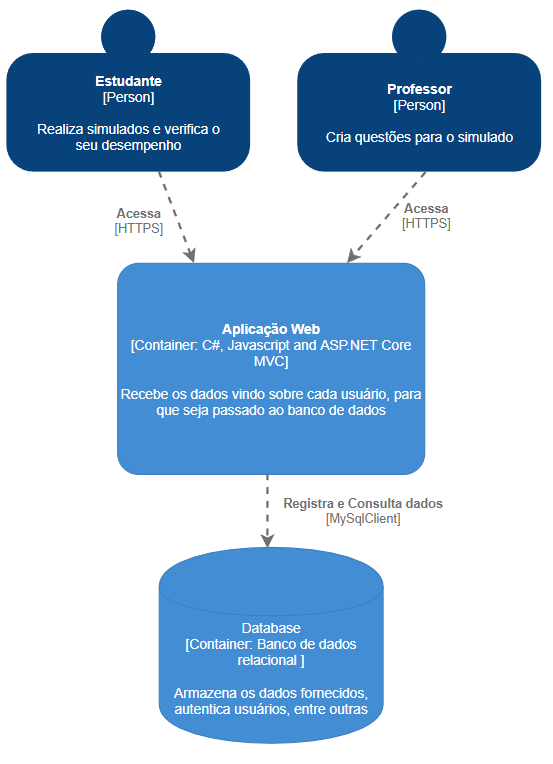
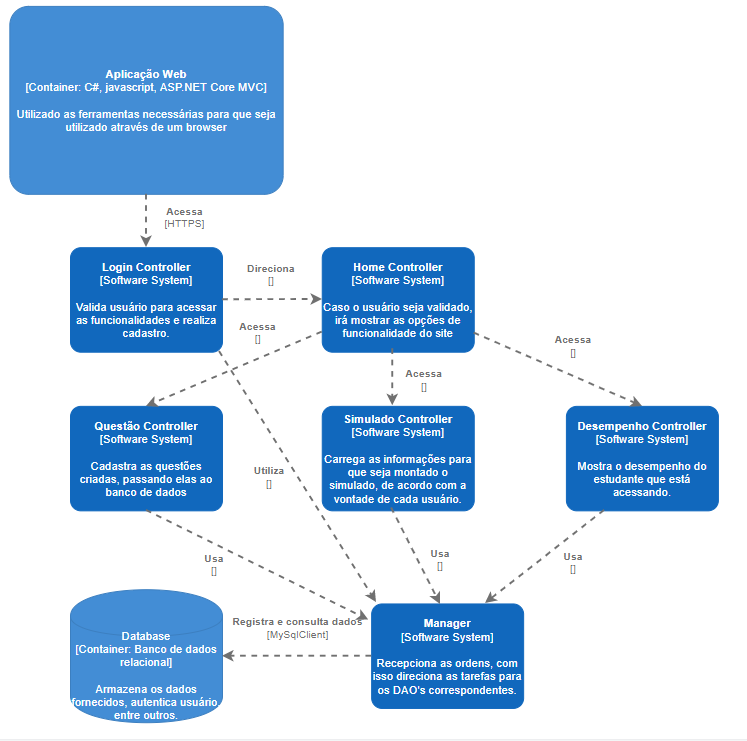
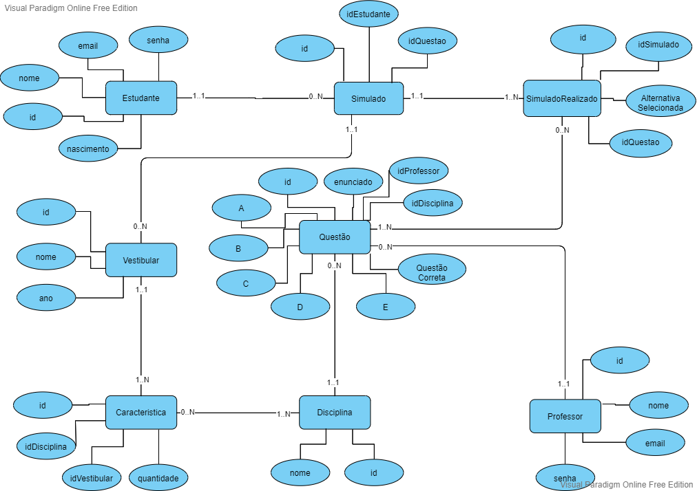
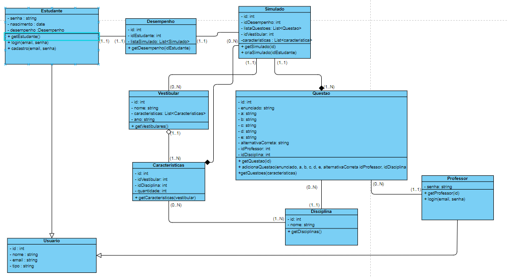
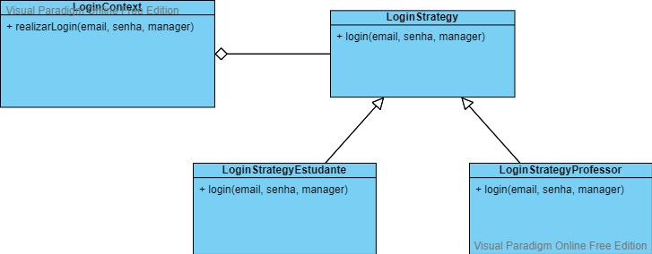

<h1 align="center">
    Studer - Plataforma de Estudo para Vestibulares
</h1>

<h3 align="center">
O Studer é uma plataforma onde um estudante poderá realizar simulados, divididos por categorias e analisar o desempenho dos seus simulados realizados.
</h3>

<h3>
&nbsp;&nbsp;&nbsp;&nbsp;&nbsp;&nbsp;&nbsp;&nbsp;Foi pensado para os estudantes para prepararem eles aos vestibulares que desejam prestar, trazendo assim questões criadas por professores que tem o cadastro no sistema, podendo escolher um vestibular específico para que os simulados sejam o mais semelhante com o que foi selecionado, conforme o aluno for praticando, mais familiarizado estará com o formato do vestibular, sobre as questões no simulado, além das questões de anos anteriores, são colocadas as questões de professores que criam com base no vestibular em específico.
</h3>

    <h3>Integrantes: </h3> 
    
Giovanni Mayer Sanches Zanotti - Prontuário: CP3008266

    
Lucas Dias Pedrosa - Prontuário: CP300810X

    
Marcos Vinicius Ota - Prontuário: CP3008304

 

## C4 Model

- <h3> Diagrama de Contexto </h3>
     
    A plataforma será usada por dois atores, o estudante e o professor. O Estudante irá fazer os simulados e poderá visualizar seu desempenho nos que já foram feitos. O sistema será primeiramente todo unificado, não necessitando de outros sistemas para complementa-lo, sendo assim, nele contará com a lógica da aplicação e a apresentação das informações
      
    

    - <h3> Diagrama de Container </h3>
     
    No diagrama de Container, está os 2 tipo de usuários, que vão acessar o site, um deles é o “estudante”, que tem as função de realizar simulado e analisar o desempenho, o “professor” fica com a parte de criações de questões para o simulado, esses atores acessam o site que tem a plataforma desenvolvida utilizando C#, Javascript e ASP.NET Core MVC, a aplicalção tendo sua funcionalidade de receber os dados enviados pelas partes, e após ser validados o que foi recebido, é passado para o banco de dados, o “database” foi utilizado um banco de dados relacional, responsável por armazenar as informações que chegaram até ele, podendo servir para validação de certos dados, para também puxar o que foi armazenado.
      
    

    - <h3> Diagrama de Componentes </h3>
     
    Nesse diagrama de Componentes, inicia na aplicação web passando para “Login controller”, pois essa é a primeira etapa que precisa ser passada para ter acesso as funcionalidade do site, após a validação do login, irá direcionar para o “Home controller”, que é onde o usuário irá visualizar as funcionalidades que estão a disposição, isso depende se ele é um “estudante” ou “professor”, com base na escolha do usuário, irá acessar o controlador responsável sobre o item selecionado, o “Questão Controller”, é apenas para os professores, para que cadastrem as questões criadas, que vai até o "Manager", o “Simulado Contoller” é direcionado para os estudantes, que fica com a parte de carregar as informações do usuário para que seja criado um simulado de acordo com o perfil do usuário, o "Desempenho Controller” fica com a responsabilidade de mostrar o desempenho do usuário, todos esses controller passam pelo “Manager” que tem a responsabilidade de direcionar para as funções devidas, com isso passa para o banco os dados fornecidos ou consultam os que já estão armazenados.
      
    
  
## Diagramas UML

- <h3> DER </h3>
     
    O banco de dados irá conter os estudantes cadastrados, fazendo relação com os simulados, e como os estudantes podem ter muitos simulados, e cada simulado pode conter muitas questões, foi necessário criar uma terceira tabela, sendo ela a intermediária, contendo os ids dos simulados e os ids das questões que estão sendo relacionados. Cada questão deverá conter uma determinada disciplina, para poder fazer um filtro na hora de selecionar o tipo de questão para a realização do simulado, podendo o simulado conter várias questões de várias disciplinas. Por motivos de organização, os simulados serão também relacionados a um tipo de vestibular, e cada vestibular poderá ter um conjunto de caracteristicas, sendo elas a quantidade de questões de cada disciplina que irá conter. As questões poderão ser feitas também pelos professores, então nesse momento, a ação do professor é somente a criação de questões.
      
    
      

- <h3> Diagrama de Casos de Uso </h3>
     
    Nesse diagrama podemos observar as maneiras que os usuários podem interagir com o sistema. O usuário Estudante poderá se cadastrar, e após fazer o seu login, ele tambem poderá escolher um vestibular para realizar um simulado. Ele também poderá consultar o desempenho dos seus simulados realizados. O usuário professor, após fazer o login, poderá produzir e comentar uma questão.
      
    
      
    
- <h3> Diagrama de Classes </h3>
     
    Neste diagrama de classe, tem o “Usuario” que é uma classe pai, utilizada para os “estudantes” e “professores”, na parte do “estudante” tem os campos adicionais senha, nascimento e desempenho, tendo assim as funcionalidades de “getEstudante”, “login” e “cadastro”, enquanto o professor tem a parte de senha, tendo as funcionalidades de “getProfessor” e “login”, o “Usuario” tem os campos de ID, nome, email e tipo.
Passando para o "desempenho”, tem os campos ID, ID estudante e “listaSimulado”, a funcionalidade que possui é a "getDesepenho", feito para mostrar o desempenho do estudando em que está logado, o "simulado" tem os campos de ID, ID Desempenho, listaQuestões, Id Vestibular e características, tendo as funcionalidade de "getSimulado" e "criaSimualdo", para pode gerar esses simulados, são puxados os dados sobre o “vestibular”,  que retira também as "características" sobre certo vestibular, com isso ele precisa também das questões que ficam na parte de “Questão, que armazena sobre todo o enunciado, tendo as funcionalidades de criar novas questões ou pegar uma questão de acordo com a característica solicitada, isso interligado sobre a “disciplina” para separar as matérias sobre cada questão, 
Um detalhe importante é que o “caracteristica” tem uma agregação para o vestibular, o simulado tem a composição para o “simulado” e "característica".
      
    
      

## Diagrama de Classes dos Padrões de Projeto
    
- <h3> Builder </h3>
     
    
      

- <h3> Strategy </h3>
     
    
      